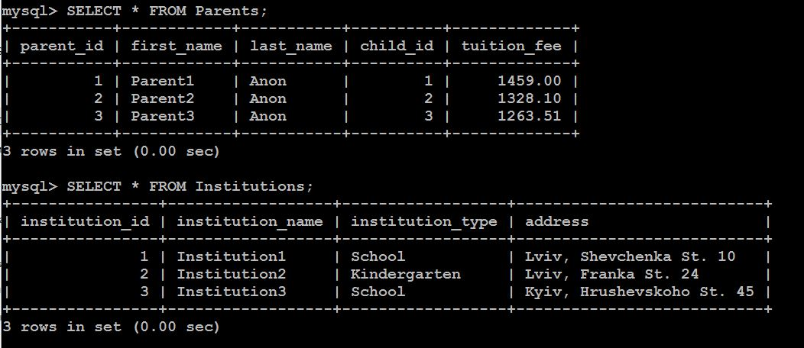

# Домашнє завдання: Lecture 13. SQL.

## Розгортаємо для зручності MySQL контейнері:

services:
  mysql:
    image: mysql:8.0
    container_name: mysql-test
    restart: unless-stopped
    environment:
      MYSQL_ROOT_PASSWORD: xxx
      MYSQL_DATABASE: SchoolDB
      MYSQL_USER: xxx
      MYSQL_PASSWORD: xxx
    ports:
      - "3306:3306"
    volumes:
      - /opt/Docker/mysql_test:/var/lib/mysql
    networks:
      - mysql_net
volumes:
  mysql_data:
networks:
  mysql_net:
    name: mysql_net
    driver: bridge

## Заходимо в інтерпритатор SQL і підключаємось до БД:

docker exec -it mysql-test mysql -u root -p
USE SchoolDB;

## Створюємо таблиці:

- Таблиця Institutions

CREATE TABLE Institutions (
    institution_id INT AUTO_INCREMENT PRIMARY KEY,
    institution_name VARCHAR(255) NOT NULL,
    institution_type ENUM('School', 'Kindergarten') NOT NULL,
    address VARCHAR(255) NOT NULL
);

- Таблиця Classes

CREATE TABLE Classes (
    class_id INT AUTO_INCREMENT PRIMARY KEY,
    class_name VARCHAR(50) NOT NULL,
    institution_id INT,
    direction ENUM('Mathematics', 'Biology and Chemistry', 'Language Studies') NOT NULL,
    FOREIGN KEY (institution_id) REFERENCES Institutions(institution_id) ON DELETE CASCADE
);

- Таблиця Children

CREATE TABLE Children (
    child_id INT AUTO_INCREMENT PRIMARY KEY,
    first_name VARCHAR(50),
    last_name VARCHAR(50),
    birth_date DATE,
    year_of_entry YEAR,
    age INT,
    institution_id INT,
    class_id INT,
    FOREIGN KEY (institution_id) REFERENCES Institutions(institution_id) ON DELETE SET NULL,
    FOREIGN KEY (class_id) REFERENCES Classes(class_id) ON DELETE SET NULL
);

- Таблиця Parents

CREATE TABLE Parents (
    parent_id INT AUTO_INCREMENT PRIMARY KEY,
    first_name VARCHAR(50),
    last_name VARCHAR(50),
    child_id INT,
    tuition_fee DECIMAL(10,2),
    FOREIGN KEY (child_id) REFERENCES Children(child_id) ON DELETE CASCADE
);

## Додавання даних (по 3 записи в кожну таблицю):

-- Institutions
INSERT INTO Institutions (institution_name, institution_type, address)
VALUES 
('Lviv Gymnasium №1', 'School', 'Lviv, Shevchenka St. 10'),
('Sunny Kindergarten', 'Kindergarten', 'Lviv, Franka St. 24'),
('Kyiv Lyceum', 'School', 'Kyiv, Hrushevskoho St. 45');

-- Classes
INSERT INTO Classes (class_name, institution_id, direction)
VALUES
('10-A', 1, 'Mathematics'),
('3-B', 3, 'Language Studies'),
('KinderGroup-1', 2, 'Biology and Chemistry');

-- Children
INSERT INTO Children (first_name, last_name, birth_date, year_of_entry, age, institution_id, class_id)
VALUES
('Anna', 'Ivanenko', '2010-04-12', 2020, 14, 1, 1),
('Oleh', 'Petrenko', '2017-11-30', 2023, 6, 2, 3),
('Iryna', 'Kovalchuk', '2011-06-01', 2021, 13, 3, 2);

-- Parents
INSERT INTO Parents (first_name, last_name, child_id, tuition_fee)
VALUES
('Olha', 'Ivanenko', 1, 1200.00),
('Andrii', 'Petrenko', 2, 800.00),
('Svitlana', 'Kovalchuk', 3, 1500.00);

## Створюємо запити:

- Діти + заклад + напрямок:

SELECT c.first_name, c.last_name, i.institution_name, cl.direction
FROM Children c
JOIN Institutions i ON c.institution_id = i.institution_id
JOIN Classes cl ON c.class_id = cl.class_id;

- Батьки + діти + вартість:

SELECT p.first_name AS parent_first_name, p.last_name AS parent_last_name,
       c.first_name AS child_first_name, c.last_name AS child_last_name, p.tuition_fee
FROM Parents p
JOIN Children c ON p.child_id = c.child_id;

- Заклади + адреса + кількість дітей:

SELECT i.institution_name, i.address, COUNT(c.child_id) AS children_count
FROM Institutions i
LEFT JOIN Children c ON i.institution_id = c.institution_id
GROUP BY i.institution_id;

## Робимо бекап бази, яка знаходиться в контейнері:

docker exec -i mysql-test mysqldump -u root -pxxx SchoolDB > SchoolDB_backup.sql

## Відновлення бази, яка знаходиться в контейнері:

docker exec -i mysql-test mysql -u root -pxxx SchoolDB < SchoolDB_backup.sql

## Анонімізація даних за рахунок змінення даних:

-- Children
UPDATE Children SET first_name = 'Child', last_name = 'Anonymous';

-- Parents
SET @i = 0;
UPDATE Parents SET 
    first_name = CONCAT('Parent', (@i := @i + 1)), 
    last_name = 'Anon';

-- Institutions
SET @j = 0;
UPDATE Institutions SET 
    institution_name = CONCAT('Institution', (@j := @j + 1));

-- Tuition Fee
UPDATE Parents SET tuition_fee = ROUND(1000 + (RAND() * 500), 2);

## Перевірка анонімізації:

SELECT * FROM Children;
SELECT * FROM Parents;
SELECT * FROM Institutions;

