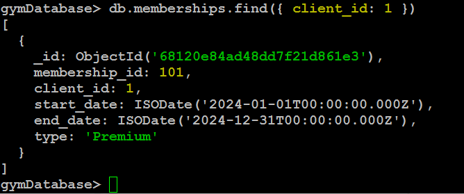
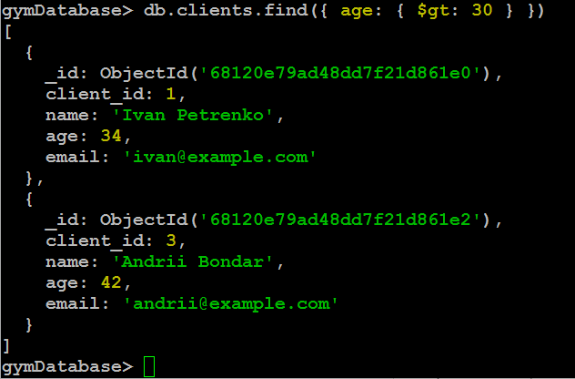
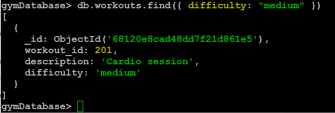

**Домашнє завдання: Lecture 14\. NoSQL.**

***Створення бази та колекцій:***  
use gymDatabase

db.createCollection("clients")  
db.createCollection("memberships")  
db.createCollection("workouts")  
db.createCollection("trainers")

***Вставка даних:***  
db.clients.insertMany(\[  
  { client\_id: 1, name: "Ivan Petrenko", age: 34, email: "ivan@example.com" },  
  { client\_id: 2, name: "Olena Kozak", age: 25, email: "olena@example.com" },  
  { client\_id: 3, name: "Andrii Bondar", age: 42, email: "andrii@example.com" }  
\])

db.memberships.insertMany(\[  
  { membership\_id: 101, client\_id: 1, start\_date: ISODate("2024-01-01"), end\_date: ISODate("2024-12-31"), type: "Premium" },  
  { membership\_id: 102, client\_id: 2, start\_date: ISODate("2024-03-01"), end\_date: ISODate("2024-09-01"), type: "Basic" }  
\])

db.workouts.insertMany(\[  
  { workout\_id: 201, description: "Cardio session", difficulty: "medium" },  
  { workout\_id: 202, description: "Strength training", difficulty: "high" },  
  { workout\_id: 203, description: "Yoga class", difficulty: "low" }  
\])

db.trainers.insertMany(\[  
  { trainer\_id: 301, name: "Sergiy Novak", specialization: "Cardio" },  
  { trainer\_id: 302, name: "Maria Danylenko", specialization: "Yoga" }  
\])

***Запити:***

* ***Клієнти віком понад 30:***

db.clients.find({ age: { $gt: 30 } })

* ***Тренування середньої складності:***

db.workouts.find({ difficulty: "medium" })

* ***Інформація про членство за client\_id:***

db.memberships.find({ client\_id: 1 })

