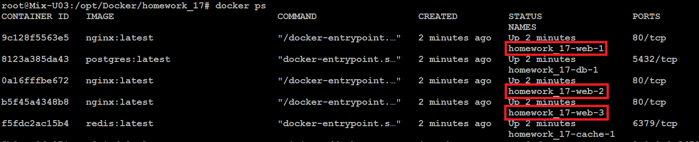

**Домашнє завдання: Lecture 17\. Docker-compose.**

***Створення файлу docker-compose.yml:***  
---

services:  
  web:  
    image: nginx:latest  
    volumes:  
      \- web-data:/usr/share/nginx/html:ro  
    networks:  
      \- appnet  
    ports:  
      \- "8888:80"

  db:  
    image: postgres:latest  
    environment:  
      POSTGRES\_USER: xxx  
      POSTGRES\_PASSWORD: xxx  
      POSTGRES\_DB: xxx  
    volumes:  
      \- db-data:/var/lib/postgresql/data  
    networks:  
      \- appnet

  cache:  
    image: redis:latest  
    networks:  
      \- appnet

volumes:  
  db-data:  
  web-data:

networks:  
  appnet:  
    name: appnet  
---

***Створення файлу index.html:***  
В зв'язку з тим, що в завданні вказано зробити саме volume web-data, то після запуску контейнерів в папці /var/lib/docker/volumes/ знаходимо volume web-data  

і в ній змінюємо index.html. Після перезапуску контейнеру отримуємо бажаний результат:  

***В наявності створена нами мережа "appnet":***  

***Підключаємось до БД в контейнері з PostgreSQL:***

* *docker exec \-it homework\_17\_01-db-1 psql \-U xxx \-d xxx*

***Масштабування сервісів.***  
Для масштабування сервісів треба прибрати прокинутий порт (ports: \- "8888:80"), т.я. всі контейнери web не можуть використовувати один і той самий порт. Після цього можна запускати масштабування (при потребі потім достукатись до веб серверів можна буде, наприклад, через балансер):

* *docker compose up \-d \--scale web=3*

Перевіряємо наявність трьох клонів web:

* *docker ps*

