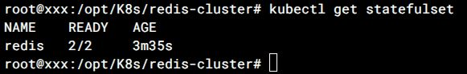
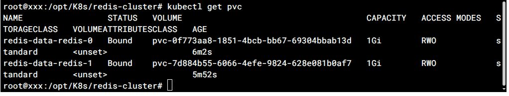
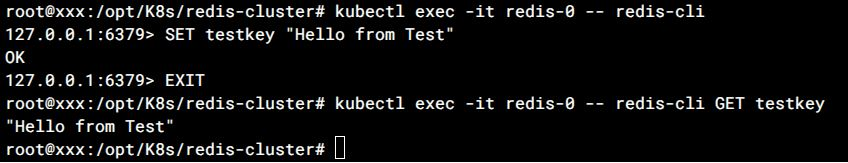
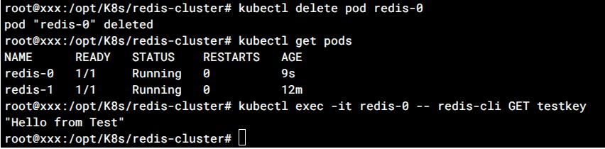
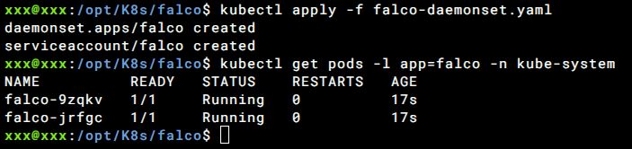
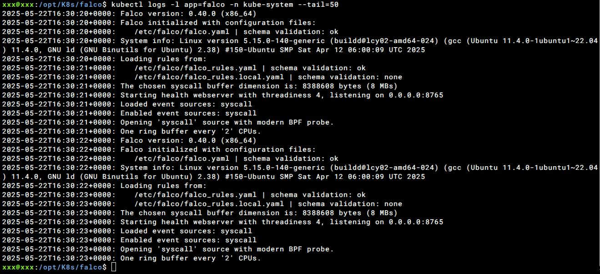

# Домашнє завдання: Lecture 20\. Selfhosted K8s.

## Завдання 1: Створення StatefulSet для Redis-кластера

### 1. Запуск Minikube та перевірка стану кластеру:

```bash
minikube start --driver=docker
minikube status
```

### 2. Створення PersistentVolumeClaim (PVC):

📄 Конфігурація PVC: [redis-pvc.yaml](redis-pvc.yaml)

### 3. Застосовуємо по черзі конфігураційні файли:

📄 Конфігурація ConfigMap: [redis-config.yaml](redis-config.yaml)

📄 Конфігурація Headless Service: [redis-headless-service.yaml](redis-headless-service.yaml)

📄 Конфігурація ClusterIP Service: [redis-service.yaml](redis-service.yaml)

📄 Конфігурація StatefulSet: [redis-statefulset.yaml](redis-statefulset.yaml)

```bash
kubectl apply -f redis-config.yaml
kubectl apply -f redis-headless-service.yaml
kubectl apply -f redis-service.yaml
kubectl apply -f redis-statefulset.yaml
```

### 4. Перевірка розгортання:

Перевіряємо, що поди створені та працюють:

```bash
kubectl get pods -l app=redis
```


Перевіряємо, що StatefulSet створено:

```bash
kubectl get statefulset
```



Перевіряємо, що PVC створені:

```bash
kubectl get pvc
```



### 5. Перевірка роботи Redis

#### Запис даних у Redis-0

Підключення до redis-0, встановлення ключа-значення та перевірка, що дані доступні:

```bash
kubectl exec -it redis-0 -- redis-cli
> SET testkey "Hello from Test"
> EXIT
kubectl exec -it redis-0 -- redis-cli GET testkey
```



#### Перевірка роботи після перезапуску

Видаляємо под

```bash
# Видаляємо под
kubectl delete pod redis-0

# Перевіряємо, що под відновлено
kubectl get pods

# Перевіряємо, що дані збереглися
kubectl exec -it redis-0 -- redis-cli GET testkey
```




## Завдання 2: Налаштування Falco в Kubernetes за допомогою DaemonSet

### 1. Створення кластера Minikube з двома вузлами:

```bash
minikube start --nodes=2 --driver=docker
minikube status
```

### 2. Розгортання:
📄 Конфігурація DaemonSet: [falco-daemonset.yaml](falco-daemonset.yaml):

```bash
kubectl apply -f falco-daemonset.yaml
```

### 3. Перевірка стану подів:

```bash
kubectl get pods -l app=falco -n kube-system
```



### 4. Перевірка логів Falco:

```bash
kubectl logs -l app=falco -n kube-system --tail=50
```


