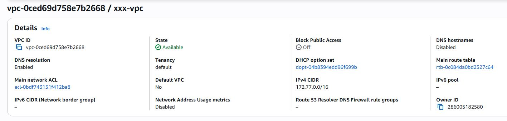
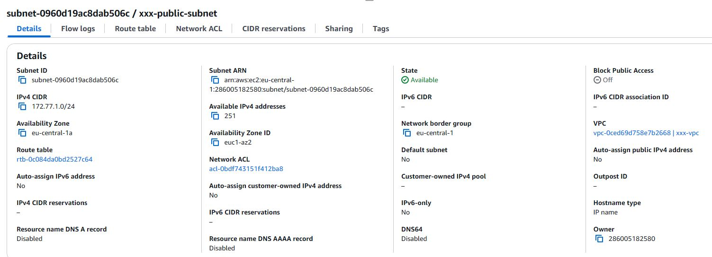
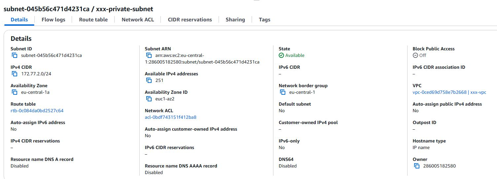
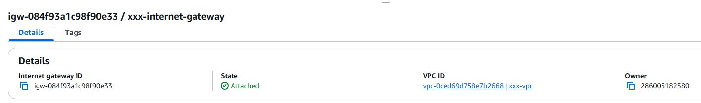
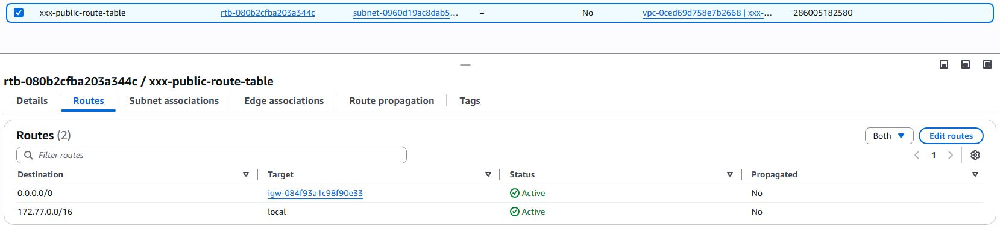
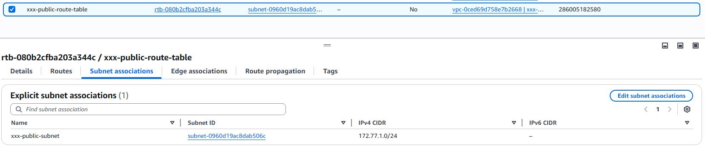
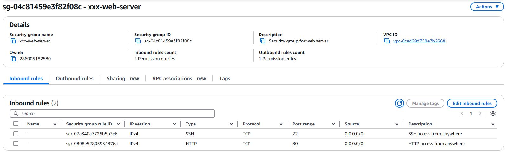
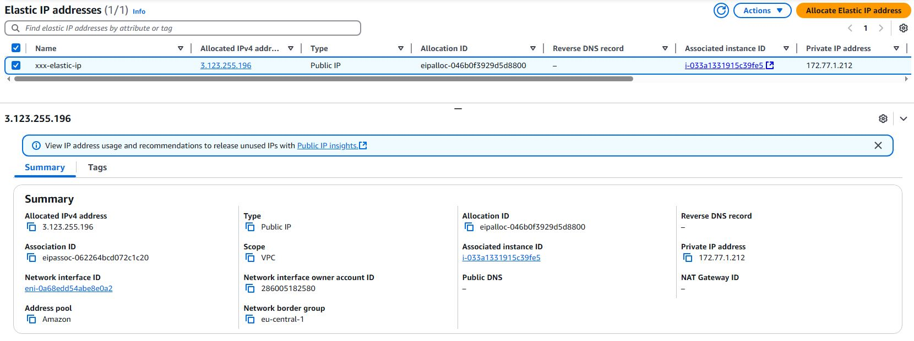
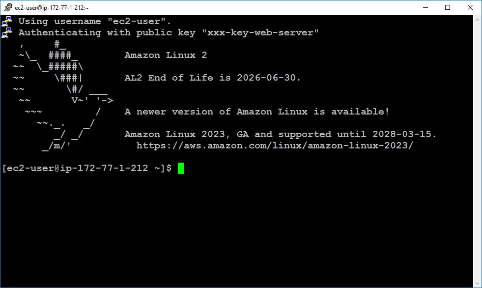
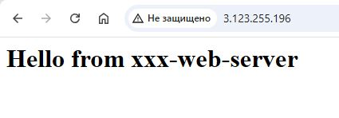

# Домашнє завдання: Lecture 22\. AWS Basics.

## Завдання 1: Створення та налаштування VPC

### 1.1. Створюємо нову VPC:

### 1.2. Створюємо дві підмережі в VPC:

Публічну підмережу

Приватну підмережу

### 1.3. Створюємо та налаштовуємо інтернет-шлюз:

Прив'язуємо інтернет-шлюз до VPC

Та налаштовуємо таблицю маршрутизації для забезпечення доступу до інтернету з публічної підмережі

## Завдання 2: Налаштування груп безпеки (Security Groups) та списків контролю доступу (ACL)

Додаємо правила для дозволу вхідного HTTP та SSH трафіку з будь-якої IP-адреси:

## Завдання 3: Запуск інстансу EC2

Запускаємо новий інстанс EC2, використовуючи створені публічну підмережу, Security Group та SSH-ключ.

## Завдання 4: Призначення еластичної IP-адреси (EIP)

Створюємо та призначаємо EIP до інстансу:

Підключаємось по EIP до інстанса:

Встановлюємо веб-сервер для перевірки доступності та перевірка за адресою EIP http://3.123.255.196:

