# Домашнє завдання: Lecture 25\. AWS EKS.

## 1. Створюємо кластер EKS

- Встановлюємо потрібні програми AWS CLI v2, kubectl, eksctl:

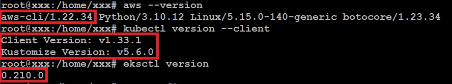


- Створюємо в AWS / Identity and Access Management (IAM) / Users користувача и сворюємо для нього Access key. Налаштовуємо AWS CLI і перевіряємо:

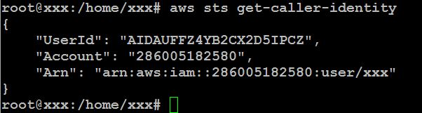


- Створюємо кластер EKS за допомогою eksctl:

Конфігурація кластеру: [cluster-config.yaml](cluster-config.yaml)

```bash
eksctl create cluster -f cluster-config.yaml

# Для себе: Якщо щось пішло не так (то версія не та, то дистр ОС не той, то ретроградний Меркурій), для видалення кластеру разом з вузлами:
# eksctl delete cluster --name eks-lab-cluster --region eu-north-1
```

## 2. Налаштування kubectl для доступу до кластера

```bash
# Перевірка підключення
kubectl get nodes
# Перевірка стану кластера
kubectl cluster-info
```

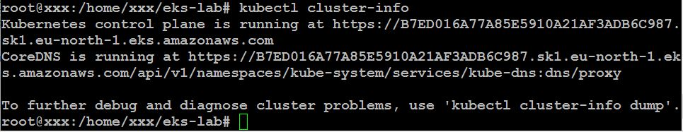

## 3. Розгортання статичного вебсайту

- Створюємо ConfigMap з HTML контентом: [configmap.yaml](configmap.yaml)
- Створюємо Deployment: [deployment.yaml](deployment.yaml)
- Створюємо Service: [service.yaml](service.yaml)

Застосувуємо маніфести:

```bash
cd /home/xxx/eks-lab
kubectl apply -f manifests/website/configmap.yaml
kubectl apply -f manifests/website/deployment.yaml
kubectl apply -f manifests/website/service.yaml
```

Перевіряємо розгортання:

```bash
kubectl get all
```

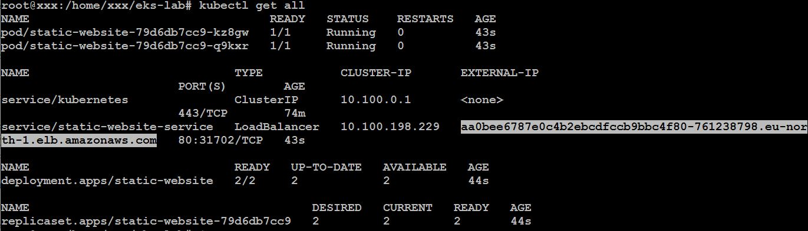

Звідки дізнаємось публічну адресу Load Balancer'у:
http://aa0bee6787e0c4b2ebcdfccb9bbc4f80-761238798.eu-north-1.elb.amazonaws.com
і при переході по неї спостерігаємо працюючий статичний сайт:

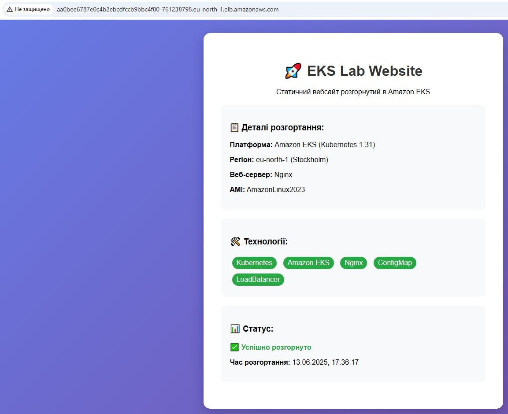

Отримуємо детальну інформацію про сервіс та перевіряємо поди:

```bash
kubectl describe svc static-website-service
kubectl get pods -o wide
```
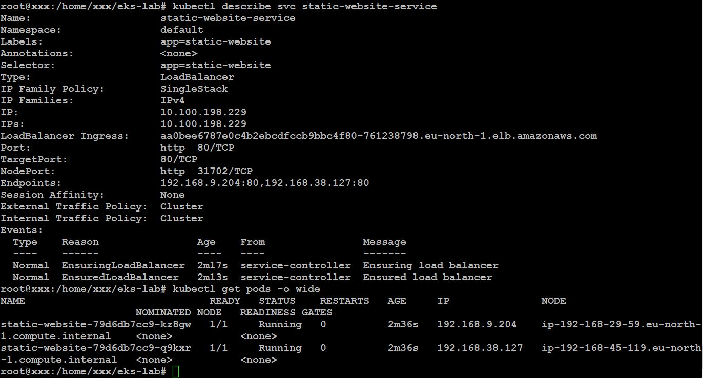

## 4. Створення PersistentVolumeClaim для збереження даних

- Створюємо PVC [pvc.yaml](pvc.yaml), застосовуємо і перевіряємо:

```bash
kubectl apply -f pvc.yaml
kubectl get pvc
```

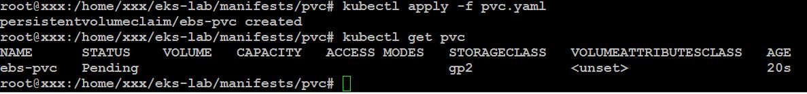

- Створюємо Pod [pod-with-storage.yaml](pod-with-storage.yaml) з використанням PVC:

```bash
kubectl apply -f pod-with-storage.yaml
```

- Зберігаємо дані в под для подальшого тестування:

```bash
# Підключаємось до Pod
kubectl exec -it nginx-with-storage -- /bin/bash

# Всередині контейнера
cd /usr/share/nginx/html/data
echo "Test data on EBS volume - $(date)" > persistent-test.txt
echo "<h2>Persistent Files</h2>" > index.html
echo "<ul>" >> index.html
echo "<li>File 1: persistent-test.txt</li>" >> index.html
echo "<li>Created at: $(date)</li>" >> index.html
echo "</ul>" >> index.html

# Перевіряємо файли
ls -la
cat persistent-test.txt
exit
```

- Створюємо Service [pod-with-storage_service.yaml](pod-with-storage_service.yaml) для доступу до Pod і застосовуємо його:

```bash
kubectl apply -f pod-with-storage.yaml

# Для того, щоб узнати публічну адресу
kubectl get services
```

- І заходимо в браузері по адресі:
http://a605f48b7b27d48b791cb293806e7b89-732487663.eu-north-1.elb.amazonaws.com

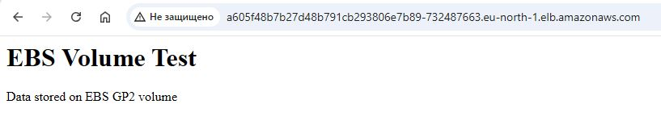

- Тестуємо стійкість даних:

```bash
# Видаляємо Pod
kubectl delete pod nginx-with-storage

# Створюємо новий Pod
kubectl apply -f pod-with-storage.yaml
```

- Чекаемо, поки Pod буде готовий і перевіряємо, що дані збереглися оновив сторінку
http://a605f48b7b27d48b791cb293806e7b89-732487663.eu-north-1.elb.amazonaws.com

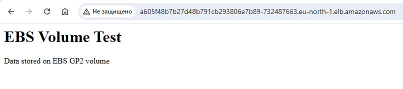

## 5. Запуск завдання за допомогою Job

- Створюємо простий Job [simple-job.yaml](simple-job.yaml), застосовуємо і робимо моніторинг виконання Job:

```bash
# Перевіряємо статус Job
kubectl get jobs

# Перевіряємо Pod, створений Job'ом
kubectl get pods -l app=hello-job

# Дивимось логи Job'а
kubectl logs -l app=hello-job
```

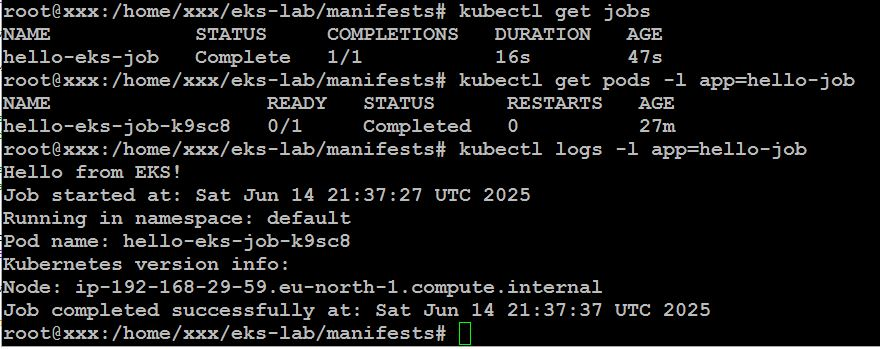

## 6. Розгортання тестового застосунку

- Створюємо файл [nginx-app.yaml](nginx-app.yaml) і застосовуємо конфігурацію:

```bash
kubectl apply -f nginx-app.yaml
```

- Перевіряємо статус Deployment:

```bash
kubectl get deployments
kubectl get pods -l app=nginx
```

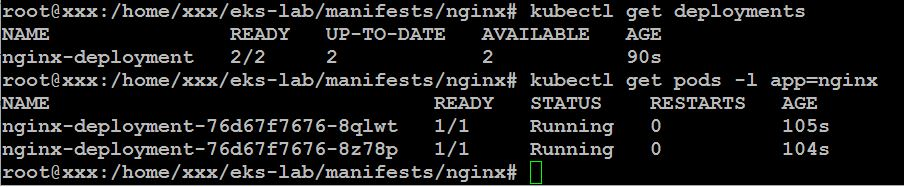

- Перевіряємо Service:

```bash
kubectl get services
kubectl describe service nginx-service
```

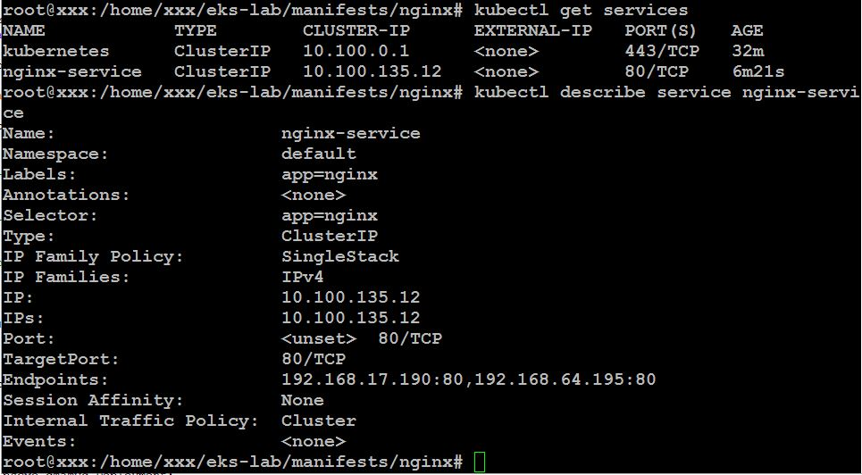

- Тестуємо доступ до застосунку всередині кластера:

```bash
# Створюємо тимчасовий под для тестування
kubectl run test-pod --image=busybox --rm -it --restart=Never -- /bin/sh
```

```bash
# Тестуємо через Service
wget -qO- http://nginx-service:80
```

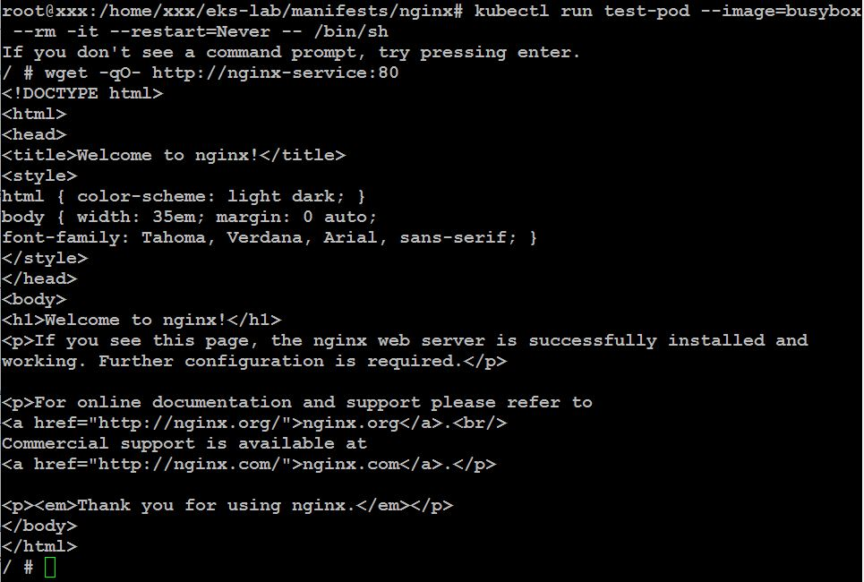

## 6. Робота з неймспейсами

- Створюємо namespace:

```bash
kubectl create namespace dev
```

- Створюємо Deployment [busybox-deployment.yaml](busybox-deployment.yaml) з busybox і застосовуємо:

```bash
kubectl apply -f busybox-deployment.yaml
```

- Перевіряємо результат:

```bash
# Перевірка deployment у namespace dev
kubectl get deployments -n dev

# Перевіряємо поди:
kubectl get pods -n dev
```

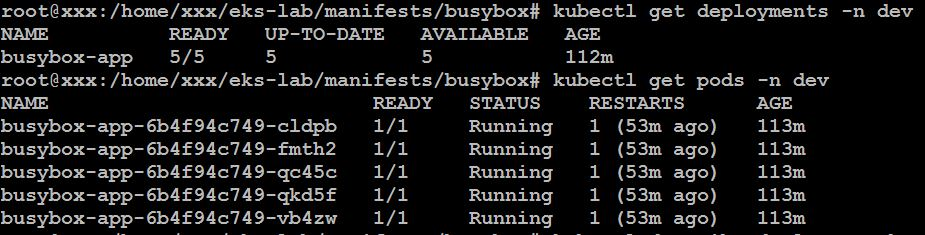

## 7. Очистка ресурсів

```bash
# Видаляємо всі Pods
kubectl delete pods --all

# Видаляємо всі Deployments
kubectl delete deployments --all

# Видаляємо всі Services
kubectl delete services --all

# Видаляємо всі PVC
kubectl delete pvc --all

# Видаляємо всі ConfigMaps
kubectl delete configmaps --all

# Видаляємо всі Secrets (окрім системних)
kubectl delete secrets --all

# Видаляємо всі Ingress
kubectl delete ingress --all

# І на останок видаляємо кластер
eksctl delete cluster --name eks-lab-cluster --region eu-north-1
```

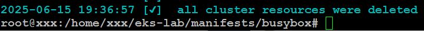
