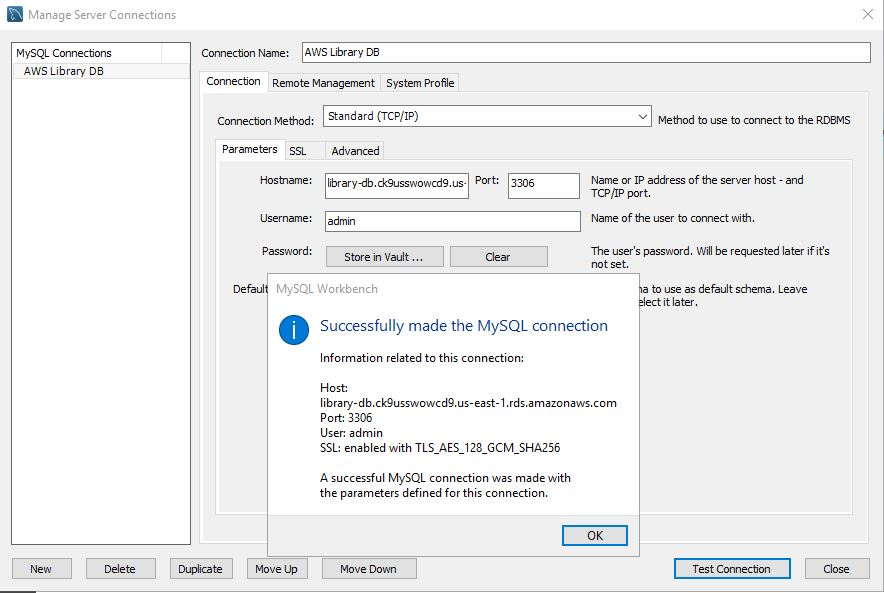

# Домашнє завдання: Lecture 27. AWS DB Services.

## 1. Створення RDS інстансу

- Cтворюємо database з endpoint: library-db.ck9usswowcd9.us-east-1.rds.amazonaws.com:3306


- В security group налаштовуємо правило для входячих з'єднань зі свого IP:


## 2. Підключення до бази




## 3. Створення бази даних та таблиць

- Створюємо ConfigMap з HTML контентом: [configmap.yaml](configmap.yaml)

```SQL
-- Створення бази даних
CREATE DATABASE library;
USE library;

-- Таблиця авторів
CREATE TABLE authors (
    id INT AUTO_INCREMENT PRIMARY KEY,
    name VARCHAR(255) NOT NULL,
    country VARCHAR(255),
    created_at TIMESTAMP DEFAULT CURRENT_TIMESTAMP
);

-- Таблиця книг
CREATE TABLE books (
    id INT AUTO_INCREMENT PRIMARY KEY,
    title VARCHAR(255) NOT NULL,
    author_id INT,
    genre VARCHAR(50),
    publication_year YEAR,
    isbn VARCHAR(20),
    created_at TIMESTAMP DEFAULT CURRENT_TIMESTAMP,
    FOREIGN KEY (author_id) REFERENCES authors(id) ON DELETE CASCADE
);

-- Таблиця статусу читання
CREATE TABLE reading_status (
    id INT AUTO_INCREMENT PRIMARY KEY,
    book_id INT,
    status ENUM('reading', 'completed', 'planned', 'abandoned') NOT NULL,
    progress_percentage INT DEFAULT 0,
    last_updated TIMESTAMP DEFAULT CURRENT_TIMESTAMP ON UPDATE CURRENT_TIMESTAMP,
    notes TEXT,
    FOREIGN KEY (book_id) REFERENCES books(id) ON DELETE CASCADE
);
```


## 4. Внесення даних

```SQL
-- Додавання авторів
INSERT INTO authors (name, country) VALUES 
('George Orwell', 'United Kingdom'),
('J.K. Rowling', 'United Kingdom'),
('Haruki Murakami', 'Japan'),
('Тарас Шевченко', 'Ukraine'),
('Ліна Костенко', 'Ukraine');

-- Додавання книг
INSERT INTO books (title, author_id, genre, publication_year, isbn) VALUES 
('1984', 1, 'Dystopian', 1949, '978-0451524935'),
('Animal Farm', 1, 'Dystopian', 1945, '978-0451526342'),
('Harry Potter and the Philosopher\'s Stone', 2, 'Fantasy', 1997, '978-0747532699'),
('Harry Potter and the Chamber of Secrets', 2, 'Fantasy', 1998, '978-0747538493'),
('Kafka on the Shore', 3, 'Magical realism', 2002, '978-1400079278'),
('Norwegian Wood', 3, 'Literary Fiction', 1987, '978-0375704024'),
('Кобзар', 4, 'Poetry', 1840, '978-966-03-4856-9'),
('Маруся Чурай', 5, 'Historical Fiction', 1979, '978-966-500-265-4');

-- Додавання статусів читання
INSERT INTO reading_status (book_id, status, progress_percentage, notes) VALUES 
(1, 'reading', 45, 'Вражаюча антиутопія'),
(2, 'completed', 100, 'Блискуча алегорія'),
(3, 'completed', 100, 'Улюблена книга дитинства'),
(4, 'planned', 0, 'Наступна для читання'),
(5, 'reading', 30, 'Складно, але цікаво'),
(7, 'completed', 100, 'Класика української літератури');
```


## 5. Виконання запитів

- Створюємо простий Job [simple-job.yaml](simple-job.yaml), застосовуємо і робимо моніторинг виконання Job:

```SQL
-- Знайдіть всі книги, які ще не прочитані:
SELECT books.title, authors.name 
FROM books
JOIN authors ON books.author_id = authors.id
LEFT JOIN reading_status ON books.id = reading_status.book_id
WHERE reading_status.status IS NULL OR reading_status.status != 'completed';
```


```SQL
-- Визначте кількість книг, які в процесі читання:

SELECT COUNT(*) AS reading_books
FROM reading_status
WHERE status = 'reading';
```


## 6. Налаштування доступу

```SQL
-- Створення нового користувача для бази даних:
CREATE USER 'library_user'@'%' IDENTIFIED BY '!@#realy_$%^str0ng_&*(passw0rd';

-- Надання йому прав:
GRANT SELECT, INSERT, UPDATE ON library.* TO 'library_user'@'%';
FLUSH PRIVILEGES;

-- Перевірка користувачів
SELECT User, Host FROM mysql.user WHERE User LIKE 'library%';
```


## 7. Моніторинг та резервне копіювання

- Налаштування резервого копіювання (Aurora and RDS --> Databases --> Modify DB instance: library-db):


- Метрики інстансу в CloudWatch (CloudWatch --> RDS):


