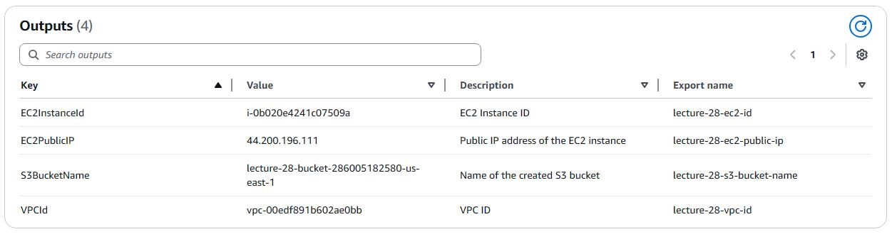
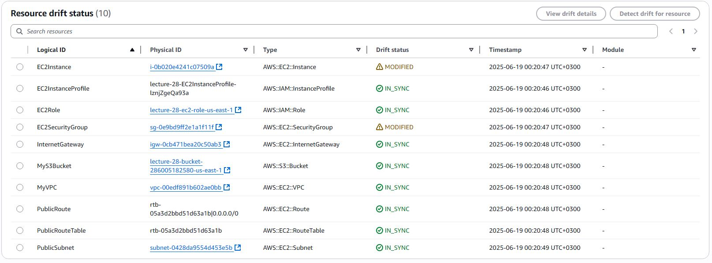

# Домашнє завдання: Lecture №28. AWS CloudFormation.

## 1. Створюємо інфраструктуру

- Спочатку в EC2 --> Key pairs створюємо Key pair;

- Після розгортання інфраструктури за допомогою стеку [infrastructure.yaml](infrastructure.yaml) дивимось Outputs:

## 2. Зміна ресурів і перевірка на Drift

- Змінюємо у інстанса Security Group та теги

- Запускаємо в CloudFormation --> Stacks --> lecture-28 --> Stack actions --> Detect drift. Після виконання дивимось Stack actions --> View drift results:

