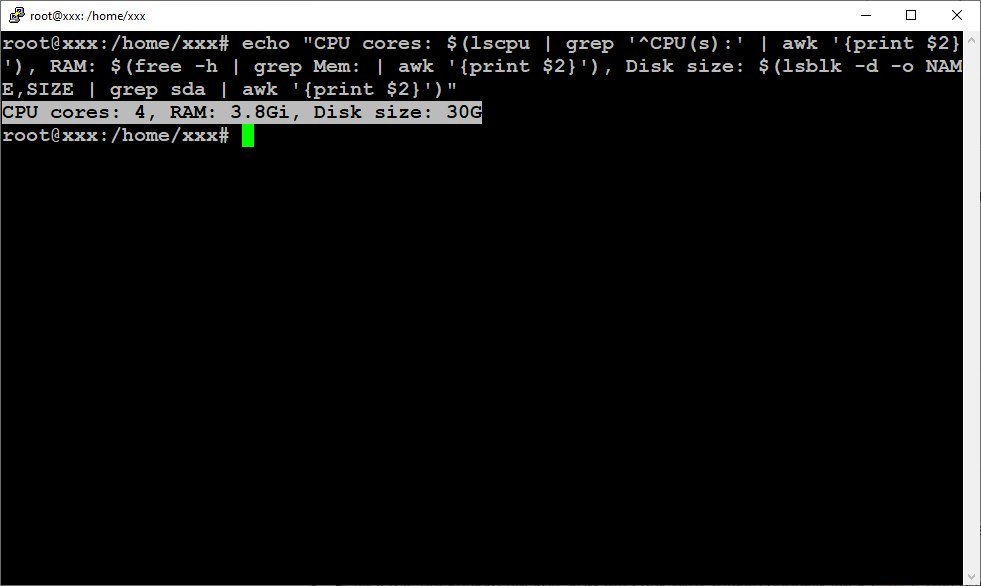

# Lecture 3 - Virtual Machine Setup and Management

У рамках цього завдання було виконано налаштування віртуальної машини (VM) у VirtualBox, збереження її стану через знімки та зміну параметрів як через графічний інтерфейс, так і через командний рядок. Нижче наведено покроковий опис виконаних дій із відповідними скриншотами.

## 1. Створення нової віртуальної машини

Було створено нову віртуальну машину з наступними параметрами:
- **Назва:** TestVM
- **Тип:** Linux
- **Версія:** Ubuntu (64-bit)

- Виділено 2 ГБ оперативної пам’яті.
- Встановлено 2 ядра процесора.
- Увімкнено опцію **Enable EFI (special OSes only)**.

- Створено новий віртуальний жорсткий диск розміром 20 ГБ у форматі VDI (VirtualBox Disk Image).

- Налаштовано мережевий адаптер у режимі **Bridged Adapter**, щоб VM могла отримати IP-адресу з локальної мережі.

## 2. Збереження та відновлення стану VM

- Створено знімок **001 (snapshot)** VM після базового налаштування системи.

- Створено файл у системі, після чого виконано відновлення VM до попереднього знімку.

  
  

## 3. Зміна параметрів віртуальної машини через графічний інтерфейс

### 3.1. Збільшення розміру жорсткого диску

  

- Оскільки кнопка **Resize** у графічному інтерфейсі не була знайдена, виконано збільшення розміру диска через командний рядок:
"C:\Program Files\Oracle\VirtualBox\VBoxManage.exe" modifyhd "S:\VMs\TestVM\TestVM.vdi" --resize 30720

- Після збільшення розміру диску розширено файлову систему в Ubuntu, щоб новий простір став доступним для використання.

### 3.2. Зміна кількості процесорних ядер та оперативної пам’яті
- Збільшено кількість ядер CPU до 4 та обсяг оперативної пам’яті до 4 ГБ.

  

- Перевірено, що зміни успішно застосовані.

## Висновки

- Знімки допомагають фіксувати стани системи, зберігаючи при цьому тільки дельту змін між ними, що добре економить місце та дають змогу швидко "переходити" з одного стану в інший.
- Зміни параметрів VM через інтерфейс мають низький поріг входження в налаштування, зручні при малій кількості розгортань VM. Але незручні при зміні інтерфейсу, або в нелогічному розташуванні тієї чи іншої кнопки/перемикача. Наприклад, мені так і не вдалось знайти кнопку Resize в налаштуваннях диску і прийшлось збільшувати його розмір через CLI.

---