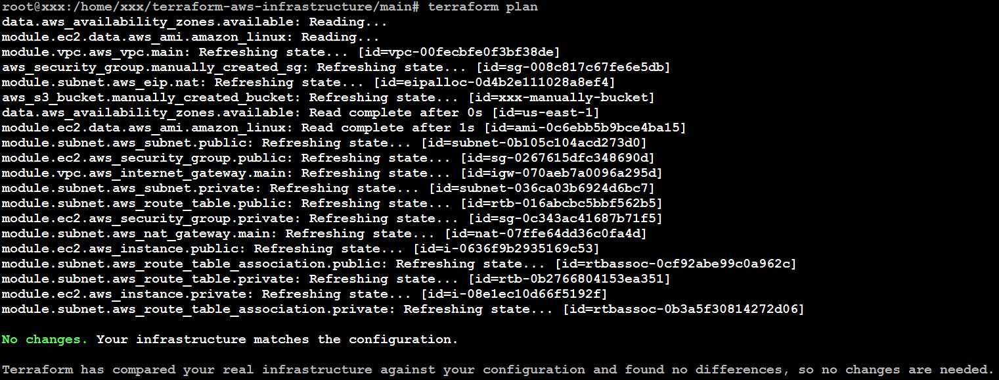

# Домашнє завдання: Lecture №30. Advanced Terraform.

## Створюємо модулі

### Модуль VPC

- [variables.tf](modules/vpc/variables.tf)
- [main.tf](modules/vpc/main.tf)
- [outputs.tf](modules/vpc/outputs.tf)

### Модуль Subnet

- [ariables.tf](modules/subnet/variables.tf)
- [main.tf](modules/subnet/main.tf)
- [outputs.tf](modules/subnet/outputs.tf)

### Модуль EC2

- [variables.tf](modules/ec2/variables.tf)
- [main.tf](modules/ec2/main.tf)
- [outputs.tf](modules/ec2/outputs.tf)

## Основна конфігурація

- [variables.tf](main/variables.tf)
- [main.tf](main/main.tf)
- [outputs.tf](main/outputs.tf)
- [terraform.tfvars](main/terraform.tfvars)

## Виконання конфігурації

```bash
# Створюємо SSH key pair
aws ec2 create-key-pair --region us-east-1 --key-name terraform-lab --query 'KeyMaterial' --output text > ~/.ssh/terraform-lab.pem
chmod 400 ~/.ssh/terraform-lab.pem

# Переходимо до main директорії
cd main

# Ініціалізуємо Terraform
terraform init

# Планування
terraform plan

# Застосовуємо конфігурацію
terraform apply
```


## Тестування

### Перевірка підключення до публічного інстансу

```bash
ssh -i ~/.ssh/terraform-lab.pem ec2-user@13.218.184.12
```


### Перевірка підключення до приватного інстансу

```bash
ssh -i ~/.ssh/terraform-lab.pem -o ProxyCommand="ssh -i ~/.ssh/terraform-lab.pem -W %h:%p ec2-user@13.218.184.12" ec2-user@10.0.2.156
```


### Тестування мережі з публічного інстансу

```bash
ping -c 3 8.8.8.8
ssh -o ConnectTimeout=5 10.0.2.156
```


### Тестування мережі з приватного інстансу

```bash
ping -c 3 www.google.com
```


## Імпорт наявних ресурсів

### Додаєм блоки ресурсів створених вручну в main.tf

```hcl
resource "aws_s3_bucket" "manually_created_bucket" {
  bucket = "xxx-manually-bucket"
}

resource "aws_security_group" "manually_created_sg" {
  name = "xxx-manually-sg"
}
```

### Імпортуємо ресурси

```bash
# Імпорт S3 bucket
terraform import aws_s3_bucket.manually_created_bucket xxx-manually-bucket

# Імпорт Security Group
# Спочатку знаходимо ID Security Group:
aws ec2 describe-security-groups --filters "Name=group-name,Values=xxx-manually-sg" --query 'SecurityGroups[0].GroupId' --output text

# Потім імпортуємо
terraform import aws_security_group.manually_created_sg sg-0aeefcb2c995feea1

# Дивимось, що terraform бачить
terraform show
```

### Доповнюємо конфігурацію main.tf параметрами з реальних ресурсів

```hcl
# S3 Imported Module
resource "aws_s3_bucket" "manually_created_bucket" {
  bucket = "xxx-manually-bucket"

  server_side_encryption_configuration {
    rule {
      bucket_key_enabled = true

      apply_server_side_encryption_by_default {
        sse_algorithm = "AES256"
      }
    }
  }

  versioning {
    enabled = false
  }
}

# VPC Imported Module
resource "aws_security_group" "manually_created_sg" {
  name        = "xxx-manually-sg"
  description = "Manually created SG"
  vpc_id      = "vpc-0409da41c74eb922b"

  egress {
    description = "Webmin for all IPv4"
    from_port   = 10000
    to_port     = 10000
    protocol    = "tcp"
    cidr_blocks = ["0.0.0.0/0"]
  }
}
```

```bash
# Після оновлення конфігурації
terraform plan
```



### Видаляємо всі створені ресурси 

```bash
# Видаляємо без інтерактивного підтвердження
terraform destroy -auto-approve
```