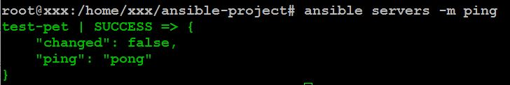
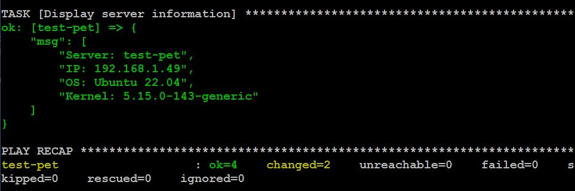
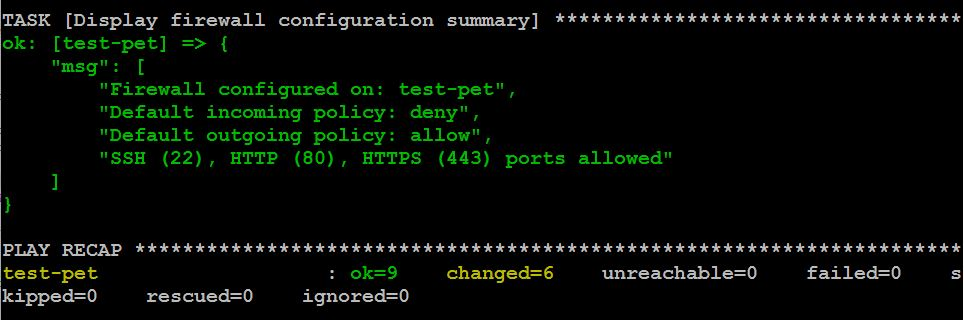
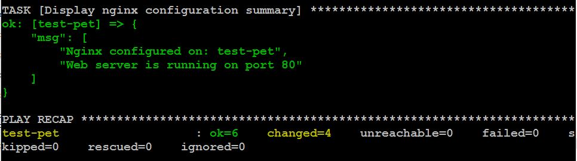
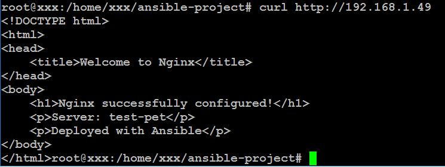
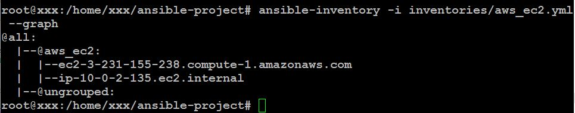
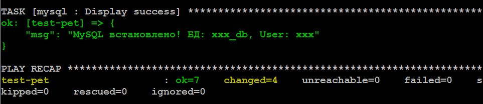
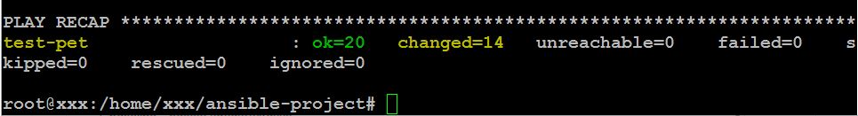

# Домашнє завдання: Lecture №32. Advanced Ansible.

## Створення ролі "baseline" для базових налаштувань серверів

### Підготовка доступу до керованого хосту

```bash
# Генерація SSH-ключа
ssh-keygen -t rsa -b 4096 -C "xxx@ansible-control"

# Копіюємо свій публічний SSH-ключ на керований хост
ssh-copy-id xxx@192.168.1.49

# Перевіряємо, підключаємось по SSH на керований хост
ssh xxx@192.168.1.49

# І додаємо користувача, щоб не питався пароль sudo
echo "xxx ALL=(ALL:ALL) NOPASSWD: ALL" | sudo tee /etc/sudoers.d/xxx
```

### Створення проекту

- [ansible.cfg](ansible.cfg)

### Створення ролі "baseline"

- [main.yml](roles/baseline/tasks/main.yml)

### Налаштування інвентаря

- [hosts](inventories/hosts)

### Створення playbook

- [baseline.yml](playbooks/baseline.yml)

### Виправимо права доступу на всі директорії

```bash
cd /home/xxx/ansible-project

# Виправимо права на всі директорії
chmod 755 group_vars host_vars inventories playbooks roles

# Рекурсивно виправимо права на файли
find . -type f -exec chmod 644 {} \;
find . -type d -exec chmod 755 {} \;
```

### Запуск playbook

```bash
# Перевірка з'єднання
ansible servers -m ping
```



```bash
# Сухий прогон (без змін)
ansible-playbook playbooks/baseline.yml --check

# Запуск playbook
ansible-playbook playbooks/baseline.yml

# Запуск з детальним виводом
# ansible-playbook playbooks/baseline.yml -v

# Запуск тільки певних тегів
# ansible-playbook playbooks/baseline.yml --tags packages
```



## Створення ролі для налаштування firewall

### Створення ролі firewall

- [main.yml](roles/firewall/tasks/main.yml)

### Створення playbook

- [firewall.yml](playbooks/firewall.yml)

### Запуск playbook

```bash
# Сухий прогон (без змін)
ansible-playbook playbooks/firewall.yml --check

# Запуск playbook
ansible-playbook playbooks/firewall.yml
```



## Створення ролі для налаштування Nginx

### Створення ролі Nginx

- [main.yml](roles/nginx/tasks/main.yml)

### Створення defaults для змінних та створення темплейту

- [main.yml](roles/nginx/defaults/main.yml)
- [index.html.j2](roles/nginx/templates/index.html.j2)

### Створення playbook

- [nginx.yml](playbooks/nginx.yml)

### Запуск playbook

```bash
# Сухий прогон (без змін)
ansible-playbook playbooks/nginx.yml --check

# Запуск playbook
ansible-playbook playbooks/nginx.yml
```



### Перевірка роботи веб-сервера

```bash
curl http://192.168.1.49
```



## Застосування dynamic inventory для управління інфраструктурою

### Встановлення необхідних пакетів

```bash
sudo apt update
sudo apt install -y python3-boto3 python3-botocore
```

### Створення dynamic inventory конфігурації

- [aws_ec2.yml](inventories/aws_ec2.yml)

### Створення playbook

- [aws-test.yml](playbooks/aws-test.yml)

### Тестування

```bash
# Перевірка inventory
ansible-inventory -i inventories/aws_ec2.yml --graph
```



## Використання Ansible Vault для шифрування конфіденційних даних

### Створюємо зашифрований файл в vault

```bash
ansible-vault create vault/mysql-secrets.yml
```

- [mysql-secrets.yml](vault/mysql-secrets.yml)

### Створюємо роль mysql

- [main.yml](roles/mysql/tasks/main.yml)

### Створення playbook

- [mysql.yml](playbooks/mysql.yml)

### Запускаємо

```bash
# Встановлення MySQL
ansible-playbook playbooks/mysql.yml --ask-vault-pass
```



## Конфігурація playbook'а з наявних ролей

### Playbook для повного розгортання сервера

- [full-server-setup.yml](playbooks/full-server-setup.yml)

### Запускаємо

```bash
ansible-playbook playbooks/full-server-setup.yml --ask-vault-pass
```


