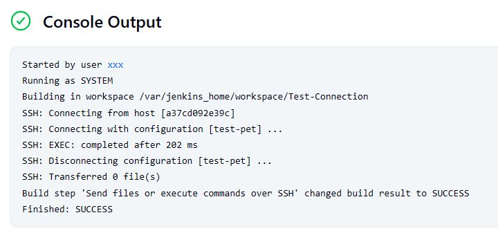
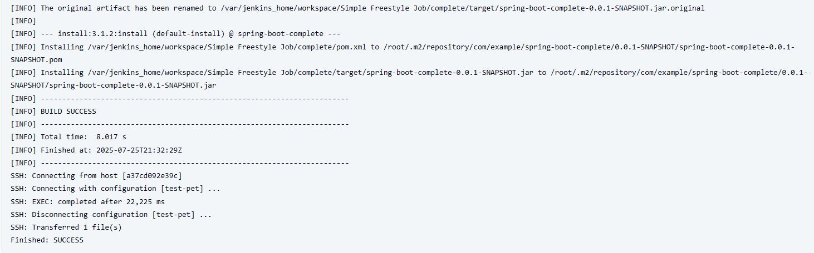
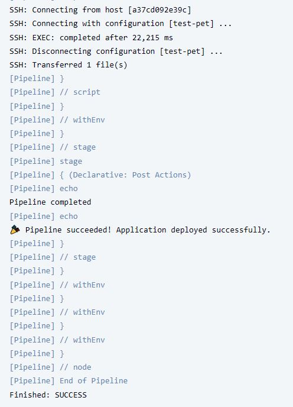

# Домашнє завдання: №34. Jenkins.

## Деплой Jenkins в контейнері

- [docker-compose.yml](Jenkins/docker-compose.yml)

## Налаштування Jenkins через веб-інтерфейс

- /opt/Docker/Jenkins/jenkins_home/secrets/initialAdminPassword – тут дивимось пароль для першого входу
- Після вхожу за адресою http://test:8080/ та налаштування адмін користувача, встановлюємо плагіни:

```Bash
- Pipeline (вже був встановлений)
- Git (вже був встановлений)
- Notify.Events (для нотифікації в Telegram)
- Publish Over SSH
```

## Налаштування EC2

- Розгортаємо інстанс
- Додаємо credentials: Jenkins → Manage Jenkins → Security → Credentials → Add credentials
- Налаштування SSH сервера: Jenkins → Manage Jenkins → System → Publish over SSH секція → SSH Servers → Add
- Створення тестового job: New Item → Freestyle project → Test-Connection → Build Steps → Send files or execute commands over SSH:
  - SSH Server: test-pet
  - Exec command:

  ```Bash
  whoami
  java -version
  ls -la /opt/spring-app/
  ```



## Налаштування Freestyle Job

### Maven installations:

- Додаємо credentials: Jenkins → Tools → Maven installations → Add Maven

### Створення Freestyle Job:

- Build Steps: Invoke top-level Maven targets
	- Maven Version: Maven 3.9.11
	- Goals: clean install
- Post-build Actions: Send build artifacts over SSH
	- Transfer Set
		- Source files: complete/target/*.jar
		- Remove prefix: complete/target/
		- Remote directory: /opt/spring-app/
		- Exec command:
```Bash
cd /opt/spring-app
ls -la
echo "JAR file in correct location:"
ls -la *.jar
./start-app.sh
echo "Waiting for application startup..."
sleep 20

# Перевіряємо процес
if ps aux | grep java | grep -v grep; then
    echo "✅ Java process is running"
    
    # Перевіряємо HTTP відповідь
    for i in {1..6}; do
        if curl -f -s http://localhost:8080; then
            echo "✅ Application is responding on port 8080"
            echo "🎉 Deployment successful!"
            break
        else
            echo "⏳ Waiting for HTTP response... attempt $i/6"
            sleep 5
        fi
    done
else
    echo "❌ Java process not found"
    echo "Recent logs:"
    tail -10 app.log
fi

echo "=== Deployment completed ==="
```



## Cтворення декларативного пайплайну

### Створення Jenkinsfile:

```Jenkinsfile
pipeline {
    agent any
    
    tools {
        maven 'Maven 3.9.11'
    }
    
    environment {
        JAR_NAME = 'spring-boot-complete-0.0.1-SNAPSHOT.jar'
        DEPLOY_DIR = '/opt/spring-app'
    }
    
    stages {
        stage('Checkout') {
            steps {
                echo 'Checking out source code...'
                script {
                    echo "Building branch: ${env.BRANCH_NAME ?: 'main'}"
                    echo "Build number: ${env.BUILD_NUMBER}"
                }
            }
        }
        
        stage('Build') {
            steps {
                echo 'Building Maven project...'
                dir('complete') {
                    sh 'mvn clean install'
                }
            }
            post {
                always {
                    echo 'Archiving artifacts...'
                    archiveArtifacts artifacts: 'complete/target/*.jar', fingerprint: true
                }
                success {
                    echo 'Build completed successfully!'
                }
                failure {
                    echo 'Build failed!'
                }
            }
        }
        
        stage('Test Results') {
            steps {
                echo 'Publishing test results...'
                script {
                    // Використовуємо junit замість publishTestResults
                    if (fileExists('complete/target/surefire-reports')) {
                        junit testResults: 'complete/target/surefire-reports/*.xml', allowEmptyResults: true
                    } else {
                        echo 'No test results found'
                    }
                }
            }
        }
        
        stage('Deploy to EC2') {
            steps {
                echo 'Deploying to EC2...'
                script {
                    // Використовуємо step замість прямого виклику sshPublisher
                    step([
                        $class: 'BapSshPublisherPlugin',
                        publishers: [[
                            configName: 'test-pet',
                            transfers: [[
                                sourceFiles: 'complete/target/*.jar',
                                removePrefix: 'complete/target/',
                                remoteDirectory: '/opt/spring-app/',
                                execCommand: '''
                                    cd /opt/spring-app
                                    ls -la
                                    echo "JAR file deployed:"
                                    ls -la *.jar
                                    
                                    echo "Starting application..."
                                    ./start-app.sh
                                    
                                    echo "Waiting for application startup..."
                                    sleep 20
                                    
                                    # Перевіряємо процес
                                    if ps aux | grep java | grep -v grep; then
                                        echo "✅ Java process is running"
                                        
                                        # Перевіряємо HTTP відповідь
                                        for i in {1..6}; do
                                            if curl -f -s http://localhost:8080; then
                                                echo "✅ Application is responding on port 8080"
                                                echo "🎉 Deployment successful!"
                                                break
                                            else
                                                echo "⏳ Waiting for HTTP response... attempt $i/6"
                                                sleep 5
                                            fi
                                        done
                                    else
                                        echo "❌ Java process not found"
                                        echo "Recent logs:"
                                        tail -10 app.log || echo "No log file found"
                                        exit 1
                                    fi
                                    
                                    echo "=== Deployment completed ==="
                                '''
                            ]]
                        ]]
                    ])
                }
            }
        }
    }
    
    post {
        always {
            echo 'Pipeline completed'
        }
        success {
            echo '🎉 Pipeline succeeded! Application deployed successfully.'
        }
        failure {
            echo '❌ Pipeline failed! Check the logs for details.'
        }
        unstable {
            echo '⚠️ Pipeline completed but with issues.'
        }
    }
}
```

### Створення Pipeline Job в Jenkins:

- Definition: Pipeline script from SCM
- SCM: Git
- Repository URL: https://github.com/LeorixKol/gs-spring-boot
- Branch Specifier: */main
- Script Path: Jenkinsfile

Після Build Now лог:


