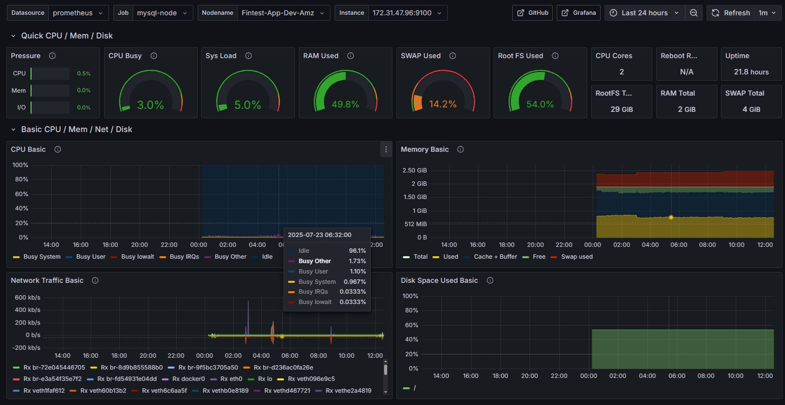
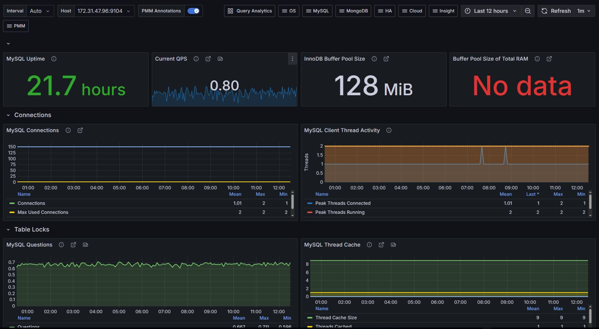
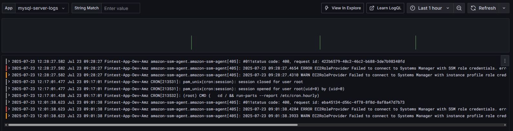

# Домашнє завдання: Lecture №35. Monitoring.

## Налаштування моніторинг-серверу

### Cтворення конфігураційних фай1лів на моніторинг-сервері

- [prometheus.yml](Metrics/prometheus/config/prometheus.yml)
- [loki-config.yml](Metrics/loki/config/loki-config.yml)
- [promtail-config.yml](Metrics/promtail/config/promtail-config.yml)

### Docker Compose для моніторинг-сервера

- [docker-compose.yml](Metrics/docker-compose.yml)

## Налаштування цільового сервера

### Створення користувача моніторингу в MySQL

```SQL
CREATE USER 'monitoring_user'@'localhost' IDENTIFIED BY 'monitoring_pass';
GRANT PROCESS, REPLICATION CLIENT, SELECT ON *.* TO 'monitoring_user'@'localhost';
FLUSH PRIVILEGES;
EXIT;
```

### Cтворення конфігураційних фай1лів на цільовому сервері

- [.my.cnf](Monitoring/mysqld-exporter/.my.cnf)
- [promtail-config.yml](Monitoring/promtail/promtail-config.yml)

### Docker Compose для цільового серверу

- [docker-compose.yml](Monitoring/docker-compose.yml)

## Налаштування Grafana

### Після запуску контейнерів в веб-інтерфейсі Grafana додаємо джерела даних

- Prometheus:
Name: Prometheus
Type: Prometheus
URL: http://prometheus:9090

- Loki:
Name: Loki
Type: Loki
URL: http://loki:3100

### Для перевірки чи все зрослося

http://172.31.3.147:9090/targets

### Імпорт дашбордів

- Node Exporter Full (ID: 1860)



- MySQL Overview (ID: 7362)



- Loki Dashboard quick search (ID: 13639)



