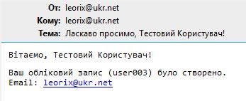

# Домашнє завдання: Lecture 37. AWS Lambda.

## Підготовка DynamoDB

### Створюємо таблицю Users і додаємо тестових записів

```JSON
{
  "userId": "user001",
  "email": "user1@example.com",
  "name": "Іван Петренко",
  "status": "active"
}

{
  "userId": "user002", 
  "email": "user2@example.com",
  "name": "Марія Коваленко",
  "status": "active"
}
```

Та вмикаємо DynamoDB Streams.

## Налаштування Lambda-функції

### Створення Lambda-функції

- Function name: email-notification-service
- Runtime: Python 3.13

### Додавання IAM ролей Lambda

- AWSLambdaDynamoDBExecutionRole
- AmazonSESFullAccess

### Додавання коду Lambda-функції

```Python
import json
import boto3
import logging

logger = logging.getLogger()
logger.setLevel(logging.INFO)

ses_client = boto3.client('ses')

SENDER_EMAIL = "leorix@ukr.net"

def lambda_handler(event, context):
    """Обробка подій DynamoDB Streams та відправлення email"""
    
    for record in event['Records']:
        # Обробляємо тільки нові записи (INSERT)
        if record['eventName'] == 'INSERT':
            # Отримуємо дані користувача
            new_item = record['dynamodb']['NewImage']
            
            user_email = new_item['email']['S']
            user_name = new_item['name']['S']
            user_id = new_item['userId']['S']
            
            # Відправляємо welcome email
            ses_client.send_email(
                Source=SENDER_EMAIL,
                Destination={'ToAddresses': [user_email]},
                Message={
                    'Subject': {
                        'Data': f'Ласкаво просимо, {user_name}!',
                        'Charset': 'UTF-8'
                    },
                    'Body': {
                        'Text': {
                            'Data': f'Вітаємо, {user_name}!\n\nВаш обліковий запис ({user_id}) було створено.\nEmail: {user_email}',
                            'Charset': 'UTF-8'
                        }
                    }
                }
            )
            
            logger.info(f'Email відправлено для користувача: {user_email}')
    
    return {'statusCode': 200}
```

### Налаштування тригера

- DynamoDB table: Users
- Batch size: 10
- Starting position: Latest

## Налаштування Amazon SES

Підтверджуємо email адресу

## Тестування системи

### Додаємо новий запис до таблиці Users в DynamoDB

```JSON
{
  "userId": "user003",
  "email": "leorix@ukr.net",
  "name": "Тестовий Користувач",
  "status": "active"
}
```

### Отримуємо сповіщення


