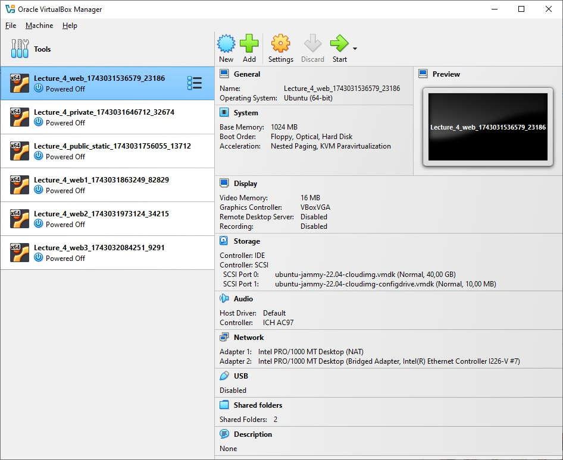

# Домашнє завдання

За допомогою створеного файлу `Vagrantfile` були створені, запущені та виконаний перелік команд у віртуальних машинах (ВМ) згідно з вимогами домашнього завдання:

Де, перші три ВМ:
- **VM1** – загальнодоступний вебсервер
- **VM2** – приватний сервер
- **VM3** – загальнодоступний сервер зі статичним IP

А три наступні ВМ – з додаткового завдання.