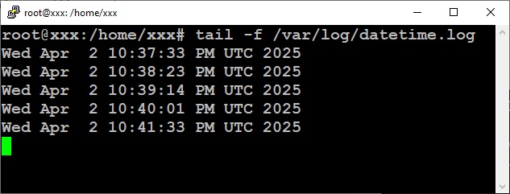

# Домашнє завдання: Lecture 6. Advanced Linux.

## Дії з репозиторіями Nginx.
- Встановлення Nginx із офіційного репозиторію:

- Додавання PPA-репозиторію для Nginx і його оновлення:

- Видалення PPA-репозиторію, повернення до офіційної версії та перевіряємо доступність:

## Створення systemd-сервісу для запуску скрипта.
- Створюємо скрипт;
- Створюємо systemd-юніт;
- Створюємо таймер;
- Активуємо та перевіряємо лог /var/log/datetime.log:

## Заборона доступу до порту 22 (SSH) з 192.168.1.100, але надання доступу з 192.168.1.50.

## Налаштування Fail2Ban для захисту від підбору паролів через SSH та послідуюча перевірка статуса.

## Створення та монтування нового розділу на диску.
- Дивимось яка конфігурація була спочатку:

- Додаємо 10 ГБ до ВМ, форматуємо і автоматично монтуємо до ФС:

## Створення розділу на доданому місці на диску sda, та монтування нового розділу.
- Дивимось яка конфігурація була спочатку:

- Додаємо 5 ГБ до диску ВМ, форматуємо і автоматично монтуємо до ФС:

