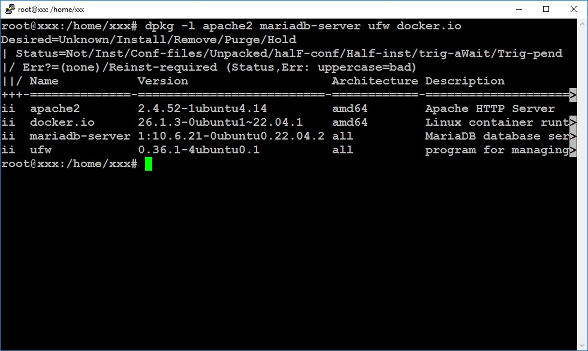
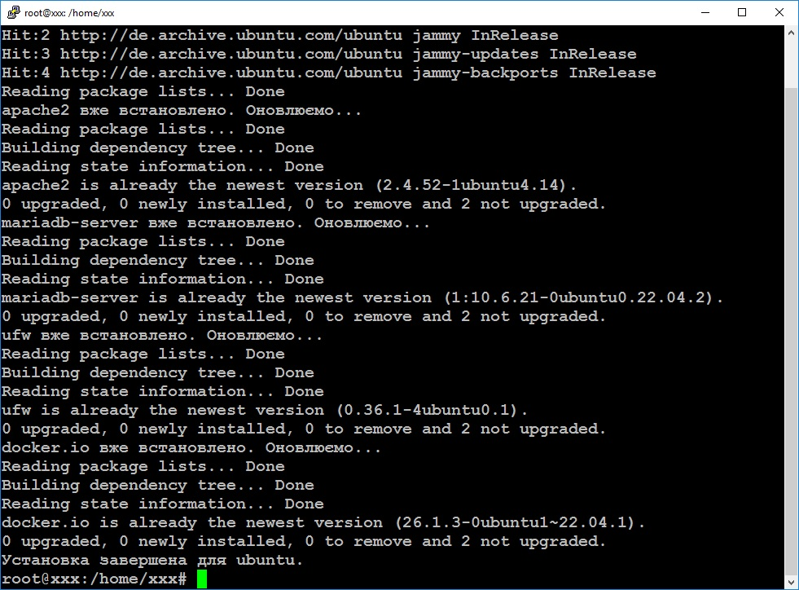

# Домашнє завдання: Lecture 8. Bash scripting.

## Bash-скрипт install.sh виконує таки дії:
- Визначає дистрибутив (Ubuntu, Debian, CentOS, Fedora)
- Встановлює стандартні пакети (apache, mariadb, ufw, docker)
- Оновлює вже встановлені пакети
При цьому використовує case, функції та масиви. Після виконання скріпта перевіряємо чи встановлені потрібні нам пакети:

## Встановлюємо додаткові пакети, передані як аргументи:
Запускаємо **install.sh** з додатковими агрументами:
./install.sh htop curl

Після повторного запуску скрипт визначає, що потрібні пакети вже встановлені і намагається їх оновити:

